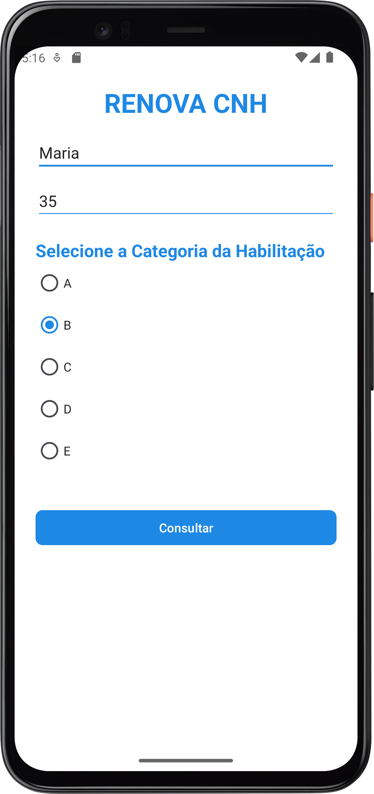
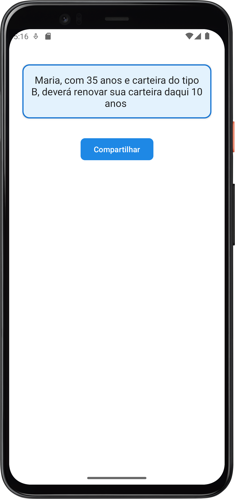
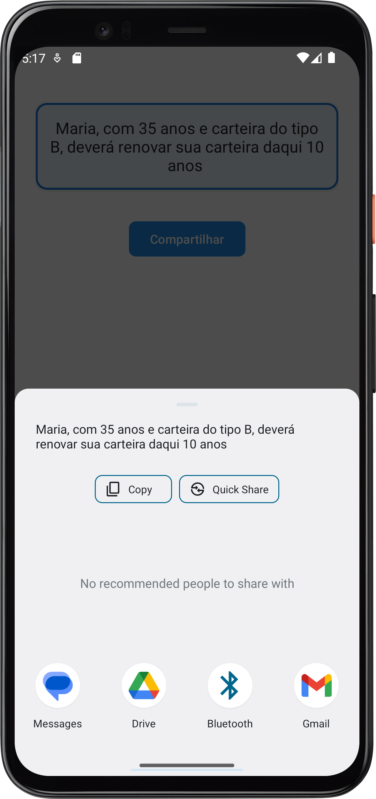

# 🪪🚗**Renovação CNH - Aplicativo Android**

Este aplicativo Android foi desenvolvido como parte da disciplina de Programação para Dispositivos Móveis no curso de Análise e Desenvolvimento de Sistemas. Por esse motivo, a implementação foi feita em Java, linguagem adotada na disciplina.

---

## 📋**Funcionalidades**

### 🏠**Tela Principal** 

- Entrada de dados do usuário: nome e idade.  
- Seleção da categoria da CNH (A, B, C, D, E) via RadioButtons.  
- Validação para garantir que uma categoria seja selecionada antes de prosseguir.  
- Botão "Consultar" que leva o usuário para a tela de relatório com as informações calculadas.

### 📄**Tela de Relatório**

- Exibe o resultado do prazo de renovação da CNH baseado na idade e categoria selecionada.  
- Indica se o usuário precisará realizar um teste toxicológico (para categorias C, D e E).  
- Botão para compartilhar o relatório via outras aplicações (e-mail, mensagens, etc.).

---

## 💻🛠️**Tecnologias e Bibliotecas Utilizadas**

- Java  
- Android Studio  
- Material Design para interface  
- Componentes Android padrão como `ConstraintLayout`, `Intent`, `RadioGroup`, `Toast` e `TextView`.

---

## 🚀**Próximos passos**

- Migrar o código para Kotlin, para aplicar essa linguagem no desenvolvimento Android.  
- Melhorar a interface visual para maior usabilidade.  
- Implementar persistência de dados com banco SQLite ou Firebase.  

---

## 📝**Como usar**

1. Insira seu nome e idade.  
2. Selecione a categoria da sua CNH.  
3. Clique em "Consultar" para ver o prazo de renovação e informações adicionais.  
4. Na tela de relatório, utilize o botão "Compartilhar" para enviar suas informações pele método mais conveniente.

---

## 📞Contato

---

## 📸 Screenshots

<table style="border-collapse: collapse; margin: 10px;">

  <tr>
    <td align="center" style="border:none;">
       
      <strong>Tela Principal</strong> 
      Interface inicial onde o usuário insere nome, idade e seleciona o tipo de CNH.
    </td>
    <td align="center" style="border:none;">
       
      <strong>Relatório de Validade</strong> 
      Exibição do relatório com a validade da CNH e opção de compartilhar.
    </td>
    <td align="center" style="border:none;">
       
      <strong>Compartilhamento</strong> 
      Tela de compartilhamento da mensagem do relatório via apps disponíveis no dispositivo.
    </td>
  </tr>
</table>

---

Desenvolvido por Thiago Henrique Diniz  
Estudante do último semestre de Análise e Desenvolvimento de Sistemas
